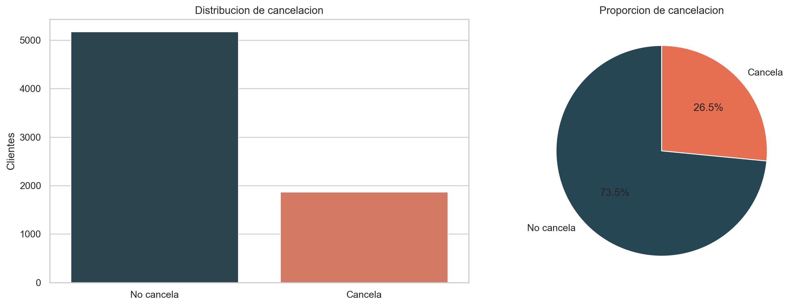
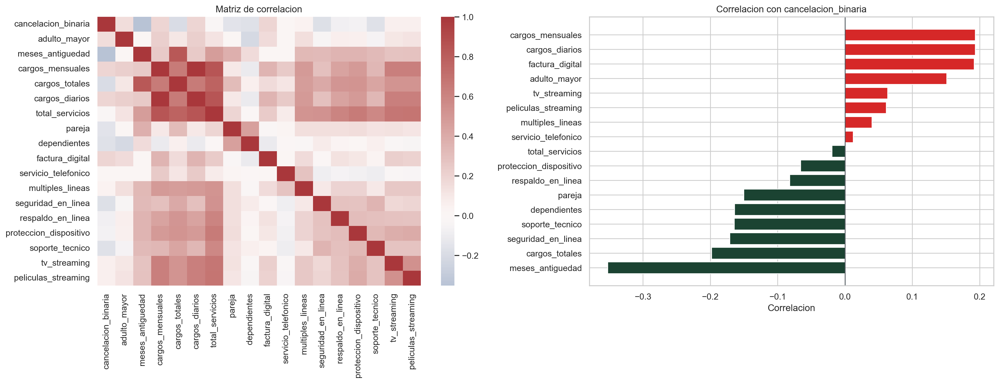
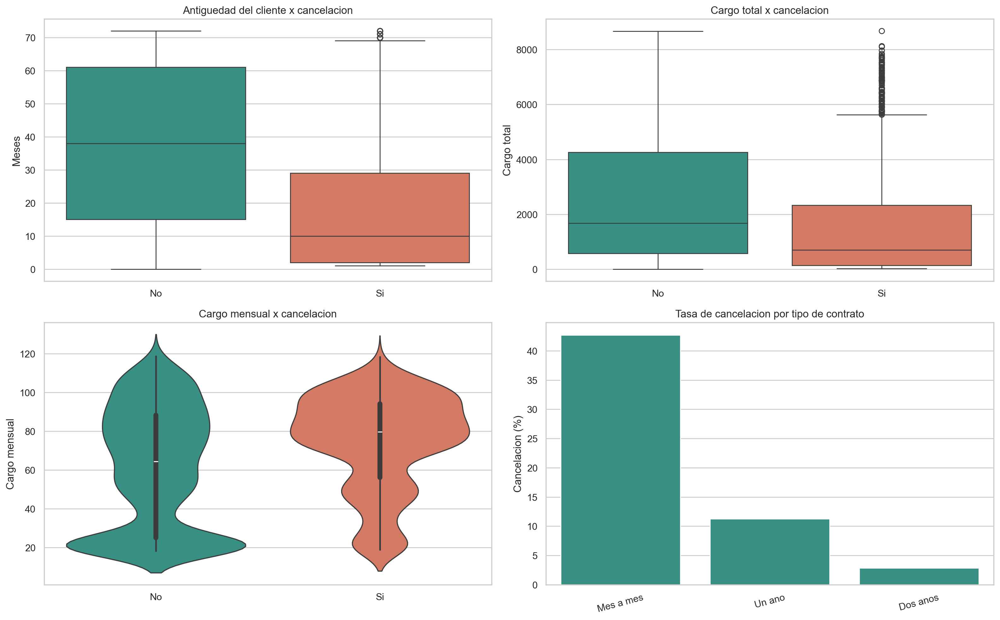
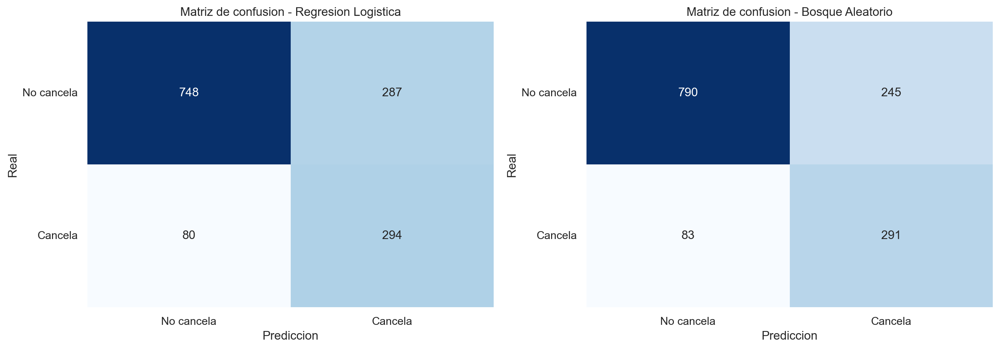
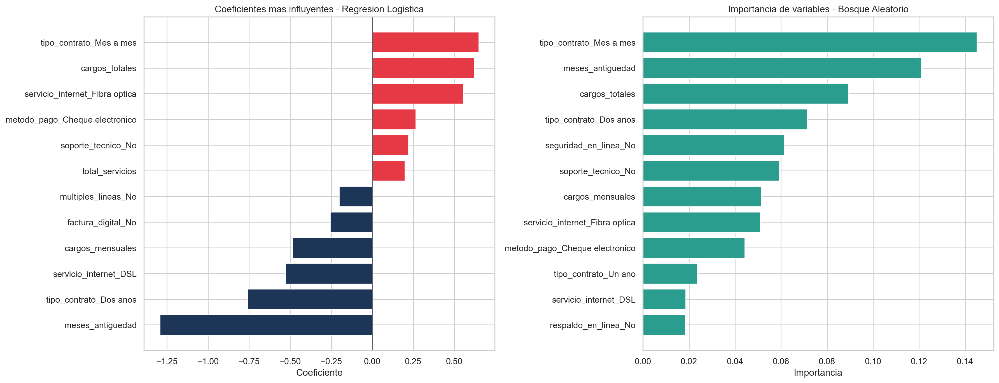

# CHALLENGE-TELECOM-X_2

Proyecto de modelado predictivo para estimar la cancelacion de clientes en Telecom X.

Toda la estructura del proyecto y los artefactos del reto fueron renombrados al espanol. Para mantener compatibilidad con GitHub y con `pip`, se conservan dos archivos puente: `README.md` y `requirements.txt`.

## Objetivo

- Regenerar el conjunto de datos tratado usando exactamente la logica de limpieza de la Parte 1.
- Preparar los datos para modelado eliminando columnas irrelevantes o redundantes.
- Entrenar y comparar dos modelos de clasificacion:
  - Regresion Logistica
  - Bosque Aleatorio
- Evaluar exactitud, precision, recall, puntaje F1 y matriz de confusion.
- Identificar las variables mas relevantes para explicar la cancelacion.

## Estructura del proyecto

- `datos/brutos/TelecomX_Datos.json`: fuente base copiada desde el proyecto anterior.
- `datos/procesados/telecomx_limpio.csv`: conjunto de datos limpio y listo para modelado.
- `cuadernos/TelecomX_2_Cancelacion.ipynb`: cuaderno principal con todo el analisis.
- `informes/metricas_modelos.csv`: comparacion de metricas entre modelos.
- `informes/graficos/`: visualizaciones exportadas del proyecto.
- `codigo/telecomx_cancelacion/flujo.py`: funciones reutilizables de limpieza, modelado y visualizacion.
- `utilidades/generar_recursos.py`: genera el CSV tratado, tablas, metricas y graficos.
- `utilidades/generar_cuaderno.py`: crea el cuaderno del proyecto.
- `requisitos.txt`: dependencias del proyecto.

## Principales hallazgos

- La proporcion de cancelacion en el conjunto limpio es `26.54%`.
- `Bosque Aleatorio` logro el mejor balance general en prueba con `exactitud = 0.7679` y `puntaje_f1 = 0.6411`.
- `Regresion Logistica` obtuvo el mejor `recall = 0.7861`, util cuando se busca detectar la mayor cantidad posible de clientes en riesgo.
- Los factores mas asociados a la cancelacion fueron:
  - tipo de contrato `Mes a mes`
  - menor `meses_antiguedad`
  - servicio `Fibra optica`
  - ausencia de `seguridad_en_linea` y `soporte_tecnico`
  - metodo de pago `Cheque electronico`

## Ejecucion

1. Instala las dependencias:

   ```bash
   pip install -r requisitos.txt
   ```

2. Genera los artefactos del proyecto:

   ```bash
   python utilidades/generar_recursos.py
   python utilidades/generar_cuaderno.py
   ```

3. Ejecuta el cuaderno:

   ```bash
   jupyter notebook cuadernos/TelecomX_2_Cancelacion.ipynb
   ```

## Visualizaciones










