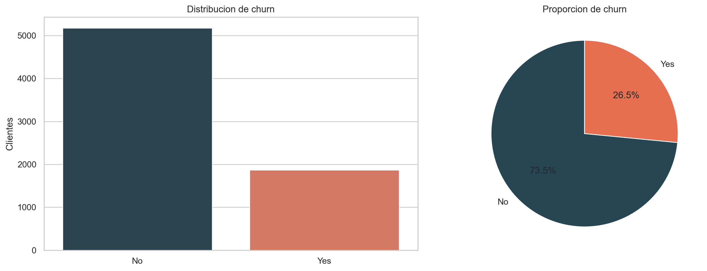
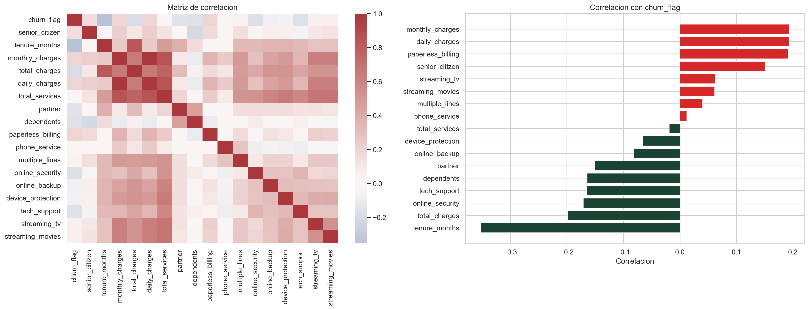
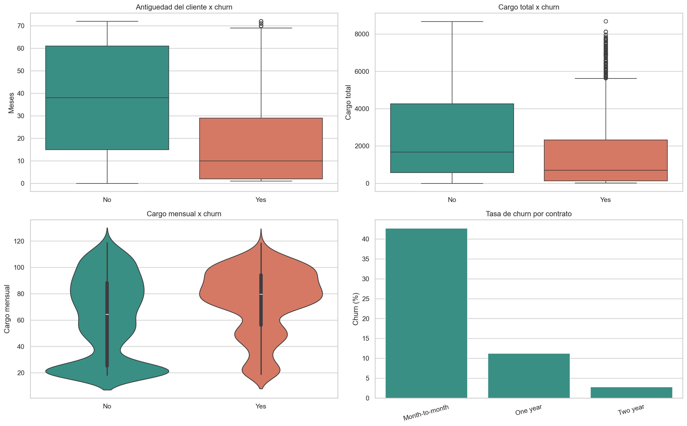
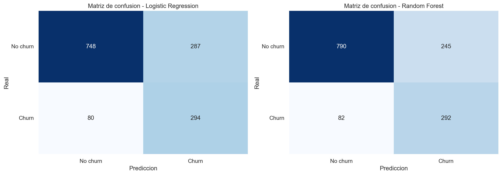
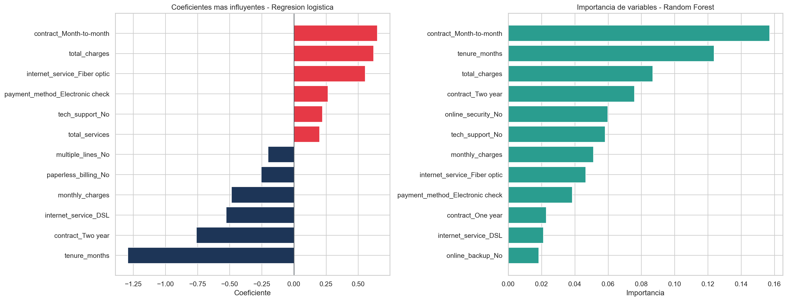

# CHALLENGE-TELECOM-X_2

Proyecto de modelado predictivo para estimar la cancelacion de clientes (churn) en Telecom X.

Este repositorio reutiliza el mismo flujo de limpieza y transformacion desarrollado en `TELECOMX_LATAM-CHALLENGE`, con el fin de mantener consistencia entre la Parte 1 (EDA) y la Parte 2 (Machine Learning).

## Objetivo

- Regenerar el dataset tratado a partir del JSON original usando la logica de limpieza de la Parte 1.
- Preparar los datos para modelado eliminando columnas irrelevantes o redundantes.
- Entrenar y comparar dos modelos de clasificacion:
  - Regresion Logistica
  - Random Forest
- Evaluar accuracy, precision, recall, F1-score y matriz de confusion.
- Identificar las variables mas relevantes para explicar el churn.

## Estructura del proyecto

- `data/raw/TelecomX_Data.json`: fuente original copiada desde el proyecto anterior.
- `data/processed/telecomx_clean.csv`: dataset limpio y listo para modelado.
- `notebooks/TelecomX_2_ML.ipynb`: notebook principal con todo el analisis.
- `reports/model_metrics.csv`: comparacion de metricas entre modelos.
- `reports/figures/`: figuras exportadas para documentacion.
- `src/telecomx_churn/pipeline.py`: funciones reutilizables de limpieza, modelado y visualizacion.
- `scripts/build_assets.py`: genera el CSV tratado, tablas, metricas y figuras.
- `scripts/generate_notebook.py`: crea el notebook del proyecto.

## Principales hallazgos

- La proporcion de churn en el dataset limpio es `26.54%`.
- `Random Forest` logro el mejor balance global en prueba con `accuracy = 0.7679` y `F1 = 0.6411`.
- `Regresion Logistica` obtuvo el mejor `recall = 0.7861`, util cuando el negocio quiere capturar la mayor cantidad posible de clientes en riesgo.
- Los factores mas asociados a la cancelacion fueron:
  - contrato `Month-to-month`
  - baja antiguedad (`tenure_months`)
  - servicio `Fiber optic`
  - falta de `online_security` y `tech_support`
  - metodo de pago `Electronic check`

## Ejecucion

1. Instala las dependencias:

   ```bash
   pip install -r requirements.txt
   ```

2. Genera los artefactos del proyecto:

   ```bash
   python scripts/build_assets.py
   python scripts/generate_notebook.py
   ```

3. Ejecuta el notebook:

   ```bash
   jupyter notebook notebooks/TelecomX_2_ML.ipynb
   ```

## Visualizaciones










